``` r
library(maftools)
```

``` r
clinical.data = read.table("tcga_laml_annot.tsv",sep="\t", header = TRUE) #read in metadata
laml.maf = read.maf("tcga_laml.maf", clinicalData = clinical.data) #create a MAF object
```

    ## -Reading
    ## -Validating
    ## -Silent variants: 475 
    ## -Summarizing
    ## -Processing clinical data
    ## -Finished in 0.580s elapsed (0.420s cpu)

``` r
#laml.df = subsetMaf(laml.maf, mafObj=FALSE) #creates a data.frame of laml.maf - this can be viewed as a table 
laml.maf
```

    ## An object of class  MAF 
    ##                    ID          summary  Mean Median
    ##  1:        NCBI_Build               37    NA     NA
    ##  2:            Center genome.wustl.edu    NA     NA
    ##  3:           Samples              193    NA     NA
    ##  4:            nGenes             1241    NA     NA
    ##  5:   Frame_Shift_Del               52 0.271      0
    ##  6:   Frame_Shift_Ins               91 0.474      0
    ##  7:      In_Frame_Del               10 0.052      0
    ##  8:      In_Frame_Ins               42 0.219      0
    ##  9: Missense_Mutation             1342 6.990      7
    ## 10: Nonsense_Mutation              103 0.536      0
    ## 11:       Splice_Site               92 0.479      0
    ## 12:             total             1732 9.021      9

``` r
#Shows sample summry.
getSampleSummary(laml.maf)
```

    ##      Tumor_Sample_Barcode Frame_Shift_Del Frame_Shift_Ins In_Frame_Del
    ##   1:         TCGA-AB-3009               0               5            0
    ##   2:         TCGA-AB-2807               1               0            1
    ##   3:         TCGA-AB-2959               0               0            0
    ##   4:         TCGA-AB-3002               0               0            0
    ##   5:         TCGA-AB-2849               0               1            0
    ##  ---                                                                  
    ## 188:         TCGA-AB-2933               0               0            0
    ## 189:         TCGA-AB-2942               0               0            0
    ## 190:         TCGA-AB-2946               0               0            0
    ## 191:         TCGA-AB-2954               0               0            0
    ## 192:         TCGA-AB-2982               0               0            0
    ##      In_Frame_Ins Missense_Mutation Nonsense_Mutation Splice_Site total
    ##   1:            1                25                 2           1    34
    ##   2:            0                16                 3           4    25
    ##   3:            0                22                 0           1    23
    ##   4:            0                15                 1           5    21
    ##   5:            0                16                 1           2    20
    ##  ---                                                                   
    ## 188:            0                 1                 0           0     1
    ## 189:            1                 0                 0           0     1
    ## 190:            0                 1                 0           0     1
    ## 191:            0                 1                 0           0     1
    ## 192:            0                 1                 0           0     1

``` r
#Shows gene summary.
getGeneSummary(laml.maf)
```

    ##       Hugo_Symbol Frame_Shift_Del Frame_Shift_Ins In_Frame_Del In_Frame_Ins
    ##    1:        FLT3               0               0            1           33
    ##    2:      DNMT3A               4               0            0            0
    ##    3:        NPM1               0              33            0            0
    ##    4:        IDH2               0               0            0            0
    ##    5:        IDH1               0               0            0            0
    ##   ---                                                                      
    ## 1237:      ZNF689               0               0            0            0
    ## 1238:      ZNF75D               0               0            0            0
    ## 1239:      ZNF827               1               0            0            0
    ## 1240:       ZNF99               0               0            0            0
    ## 1241:        ZPBP               0               0            0            0
    ##       Missense_Mutation Nonsense_Mutation Splice_Site total MutatedSamples
    ##    1:                15                 0           3    52             52
    ##    2:                39                 5           6    54             48
    ##    3:                 1                 0           0    34             33
    ##    4:                20                 0           0    20             20
    ##    5:                18                 0           0    18             18
    ##   ---                                                                     
    ## 1237:                 1                 0           0     1              1
    ## 1238:                 1                 0           0     1              1
    ## 1239:                 0                 0           0     1              1
    ## 1240:                 1                 0           0     1              1
    ## 1241:                 1                 0           0     1              1
    ##       AlteredSamples
    ##    1:             52
    ##    2:             48
    ##    3:             33
    ##    4:             20
    ##    5:             18
    ##   ---               
    ## 1237:              1
    ## 1238:              1
    ## 1239:              1
    ## 1240:              1
    ## 1241:              1

``` r
#shows clinical data associated with samples
getClinicalData(laml.maf)
```

    ##      Tumor_Sample_Barcode FAB_classification days_to_last_followup
    ##   1:         TCGA-AB-2802                 M4                   365
    ##   2:         TCGA-AB-2803                 M3                   792
    ##   3:         TCGA-AB-2804                 M3                  2557
    ##   4:         TCGA-AB-2805                 M0                   577
    ##   5:         TCGA-AB-2806                 M1                   945
    ##  ---                                                              
    ## 189:         TCGA-AB-3007                 M3                  1581
    ## 190:         TCGA-AB-3008                 M1                   822
    ## 191:         TCGA-AB-3009                 M4                   577
    ## 192:         TCGA-AB-3011                 M1                  1885
    ## 193:         TCGA-AB-3012                 M3                  1887
    ##      Overall_Survival_Status
    ##   1:                       1
    ##   2:                       1
    ##   3:                       0
    ##   4:                       1
    ##   5:                       1
    ##  ---                        
    ## 189:                       0
    ## 190:                       1
    ## 191:                       1
    ## 192:                       0
    ## 193:                       0

``` r
#Shows all fields in MAF
getFields(laml.maf)
```

    ##  [1] "Hugo_Symbol"            "Entrez_Gene_Id"         "Center"                
    ##  [4] "NCBI_Build"             "Chromosome"             "Start_Position"        
    ##  [7] "End_Position"           "Strand"                 "Variant_Classification"
    ## [10] "Variant_Type"           "Reference_Allele"       "Tumor_Seq_Allele1"     
    ## [13] "Tumor_Seq_Allele2"      "Tumor_Sample_Barcode"   "Protein_Change"        
    ## [16] "i_TumorVAF_WU"          "i_transcript_name"

``` r
#Writes maf summary to an output file with basename laml.
write.mafSummary(maf = laml.maf, basename = 'laml')
```

``` r
plotmafSummary(maf = laml.maf, rmOutlier = TRUE, addStat = 'median', dashboard = TRUE, titvRaw = FALSE)
```

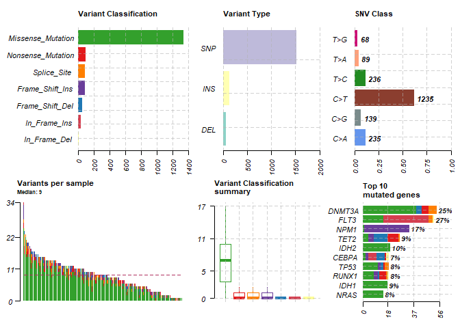

``` r
#oncoplot for top ten mutated genes.
oncoplot(maf = laml.maf, top = 10)
```

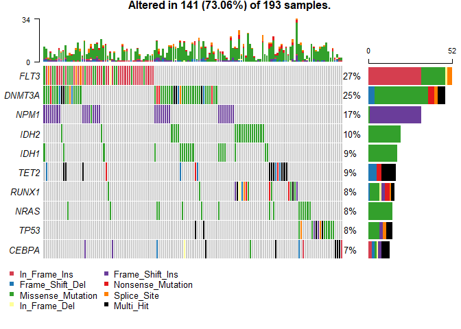

``` r
oncostrip(maf = laml.maf, genes = c('DNMT3A','NPM1', 'RUNX1'))
```

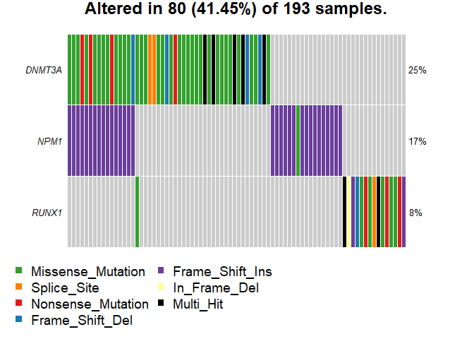

``` r
laml.titv = titv(maf = laml.maf, plot = FALSE, useSyn = TRUE)
#plot titv summary
plotTiTv(res = laml.titv)
```

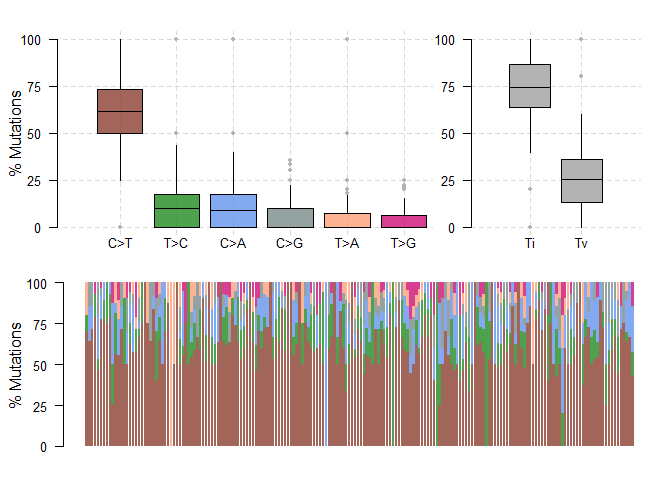

``` r
#lollipop plot for DNMT3A, which is one of the most frequent mutated gene in Leukemia.
lollipopPlot(maf = laml.maf, gene = 'DNMT3A', AACol = 'Protein_Change', showMutationRate = TRUE)
```

    ## 3 transcripts available. Use arguments refSeqID or proteinID to manually specify tx name.

    ##      HGNC refseq.ID protein.ID aa.length
    ## 1: DNMT3A NM_175629  NP_783328       912
    ## 2: DNMT3A NM_022552  NP_072046       912
    ## 3: DNMT3A NM_153759  NP_715640       723

    ## Using longer transcript NM_175629 for now.

    ## Removed 3 mutations for which AA position was not available

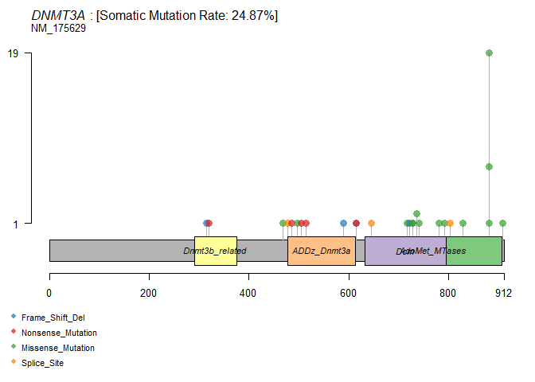

``` r
lollipopPlot(maf = laml.maf, gene = 'KIT', AACol = 'Protein_Change', labelPos = 816, refSeqID = 'NM_000222')
```

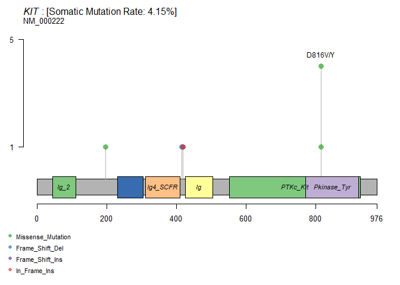

``` r
brca <- system.file("extdata", "brca.maf.gz", package = "maftools")
brca = read.maf(maf = brca, verbose = FALSE)
```

``` r
rainfallPlot(maf = brca, detectChangePoints = TRUE, pointSize = 0.6)
```

    ## Processing TCGA-A8-A08B..

    ## Kataegis detected at:

    ##    Chromosome Start_Position End_Position nMuts Avg_intermutation_dist Size
    ## 1:          8       98129348     98133560     7               702.0000 4212
    ## 2:          8       98398549     98403536     9               623.3750 4987
    ## 3:          8       98453076     98456466     9               423.7500 3390
    ## 4:          8      124090377    124096810    22               306.3333 6433
    ## 5:         12       97436055     97439705     7               608.3333 3650
    ## 6:         17       29332072     29336153     8               583.0000 4081
    ##    Tumor_Sample_Barcode C>G C>T
    ## 1:         TCGA-A8-A08B   4   3
    ## 2:         TCGA-A8-A08B   1   8
    ## 3:         TCGA-A8-A08B   1   8
    ## 4:         TCGA-A8-A08B   1  21
    ## 5:         TCGA-A8-A08B   4   3
    ## 6:         TCGA-A8-A08B   4   4

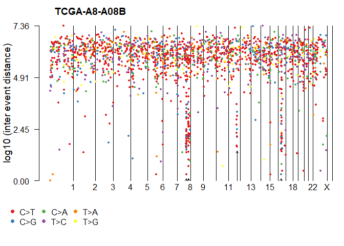

``` r
laml.mutload = tcgaCompare(maf = laml.maf, cohortName = 'Example-LAML')
```

    ## Performing pairwise t-test for differences in mutation burden..

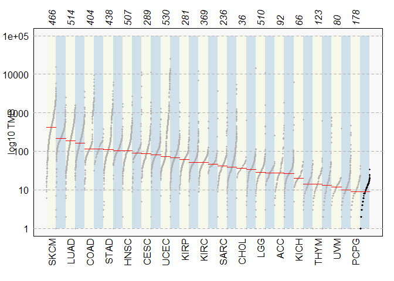

``` r
plotVaf(maf = laml.maf, vafCol = 'i_TumorVAF_WU')
```

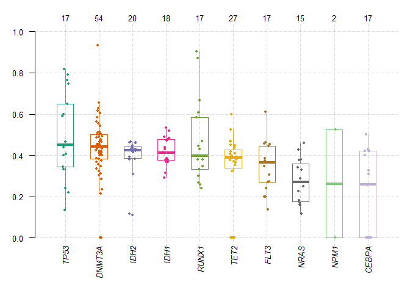

``` r
geneCloud(input = laml.maf, minMut = 3)
```

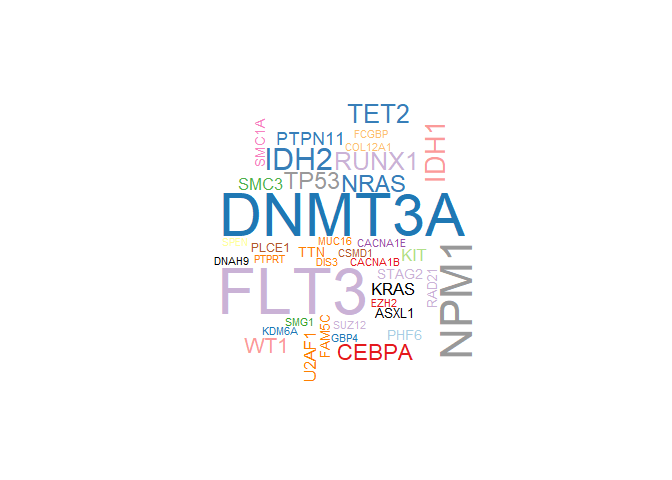

``` r
#exclusive/co-occurance event analysis on top 10 mutated genes. 
somaticInteractions(maf = laml.maf, top = 25, pvalue = c(0.05, 0.1))
```

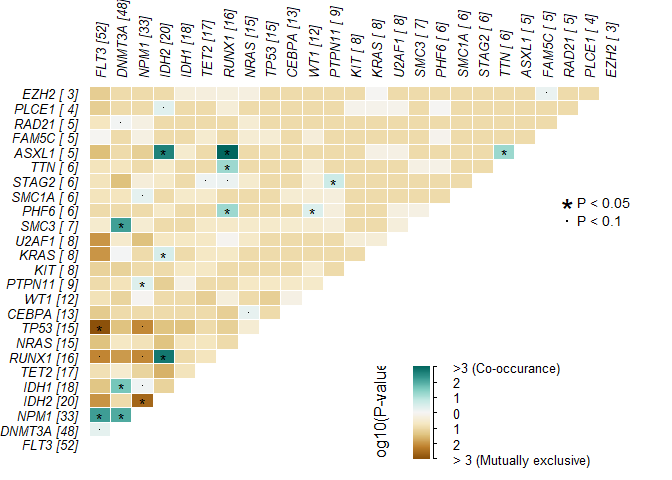

    ##      gene1  gene2       pValue oddsRatio  00 11 01 10              Event
    ##   1: ASXL1  RUNX1 0.0001541586 55.215541 176  4 12  1       Co_Occurence
    ##   2:  IDH2  RUNX1 0.0002809928  9.590877 164  7  9 13       Co_Occurence
    ##   3:  IDH2  ASXL1 0.0004030636 41.077327 172  4  1 16       Co_Occurence
    ##   4:  FLT3   NPM1 0.0009929836  3.763161 125 17 16 35       Co_Occurence
    ##   5:  SMC3 DNMT3A 0.0010451985 20.177713 144  6 42  1       Co_Occurence
    ##  ---                                                                    
    ## 296: PLCE1  ASXL1 1.0000000000  0.000000 184  0  5  4 Mutually_Exclusive
    ## 297: RAD21  FAM5C 1.0000000000  0.000000 183  0  5  5 Mutually_Exclusive
    ## 298: PLCE1  FAM5C 1.0000000000  0.000000 184  0  5  4 Mutually_Exclusive
    ## 299: PLCE1  RAD21 1.0000000000  0.000000 184  0  5  4 Mutually_Exclusive
    ## 300:  EZH2  PLCE1 1.0000000000  0.000000 186  0  4  3 Mutually_Exclusive
    ##              pair event_ratio
    ##   1: ASXL1, RUNX1        4/13
    ##   2:  IDH2, RUNX1        7/22
    ##   3:  ASXL1, IDH2        4/17
    ##   4:   FLT3, NPM1       17/51
    ##   5: DNMT3A, SMC3        6/43
    ##  ---                         
    ## 296: ASXL1, PLCE1         0/9
    ## 297: FAM5C, RAD21        0/10
    ## 298: FAM5C, PLCE1         0/9
    ## 299: PLCE1, RAD21         0/9
    ## 300:  EZH2, PLCE1         0/7

``` r
laml.sig = oncodrive(maf = laml.maf, AACol = 'Protein_Change', minMut = 5, pvalMethod = 'zscore')
```

    ## Warning in oncodrive(maf = laml.maf, AACol = "Protein_Change", minMut = 5, :
    ## Oncodrive has been superseeded by OncodriveCLUSTL. See http://bg.upf.edu/group/
    ## projects/oncodrive-clust.php

    ## Estimating background scores from synonymous variants..

    ## Not enough genes to build background. Using predefined values. (Mean = 0.279; SD = 0.13)

    ## Estimating cluster scores from non-syn variants..

    ##   |                                                                              |                                                                      |   0%  |                                                                              |===                                                                   |   4%  |                                                                              |======                                                                |   9%  |                                                                              |=========                                                             |  13%  |                                                                              |============                                                          |  17%  |                                                                              |===============                                                       |  22%  |                                                                              |==================                                                    |  26%  |                                                                              |=====================                                                 |  30%  |                                                                              |========================                                              |  35%  |                                                                              |===========================                                           |  39%  |                                                                              |==============================                                        |  43%  |                                                                              |=================================                                     |  48%  |                                                                              |=====================================                                 |  52%  |                                                                              |========================================                              |  57%  |                                                                              |===========================================                           |  61%  |                                                                              |==============================================                        |  65%  |                                                                              |=================================================                     |  70%  |                                                                              |====================================================                  |  74%  |                                                                              |=======================================================               |  78%  |                                                                              |==========================================================            |  83%  |                                                                              |=============================================================         |  87%  |                                                                              |================================================================      |  91%  |                                                                              |===================================================================   |  96%  |                                                                              |======================================================================| 100%

    ## Comapring with background model and estimating p-values..

    ## Done !

``` r
head(laml.sig)
```

    ##    Hugo_Symbol Frame_Shift_Del Frame_Shift_Ins In_Frame_Del In_Frame_Ins
    ## 1:        IDH1               0               0            0            0
    ## 2:        IDH2               0               0            0            0
    ## 3:        NPM1               0              33            0            0
    ## 4:        NRAS               0               0            0            0
    ## 5:       U2AF1               0               0            0            0
    ## 6:         KIT               1               1            0            1
    ##    Missense_Mutation Nonsense_Mutation Splice_Site total MutatedSamples
    ## 1:                18                 0           0    18             18
    ## 2:                20                 0           0    20             20
    ## 3:                 1                 0           0    34             33
    ## 4:                15                 0           0    15             15
    ## 5:                 8                 0           0     8              8
    ## 6:                 7                 0           0    10              8
    ##    AlteredSamples clusters muts_in_clusters clusterScores protLen   zscore
    ## 1:             18        1               18     1.0000000     414 5.546154
    ## 2:             20        2               20     1.0000000     452 5.546154
    ## 3:             33        2               32     0.9411765     294 5.093665
    ## 4:             15        2               15     0.9218951     189 4.945347
    ## 5:              8        1                7     0.8750000     240 4.584615
    ## 6:              8        2                9     0.8500000     976 4.392308
    ##            pval          fdr fract_muts_in_clusters
    ## 1: 1.460110e-08 1.022077e-07              1.0000000
    ## 2: 1.460110e-08 1.022077e-07              1.0000000
    ## 3: 1.756034e-07 8.194826e-07              0.9411765
    ## 4: 3.800413e-07 1.330144e-06              1.0000000
    ## 5: 2.274114e-06 6.367520e-06              0.8750000
    ## 6: 5.607691e-06 1.308461e-05              0.9000000

``` r
plotOncodrive(res = laml.sig, fdrCutOff = 0.1, useFraction = TRUE)
```

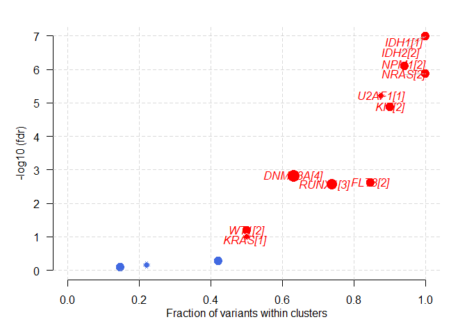

``` r
laml.pfam = pfamDomains(maf = laml.maf, AACol = 'Protein_Change', top = 10)
```

    ## Warning in pfamDomains(maf = laml.maf, AACol = "Protein_Change", top = 10):
    ## Removed 50 mutations for which AA position was not available

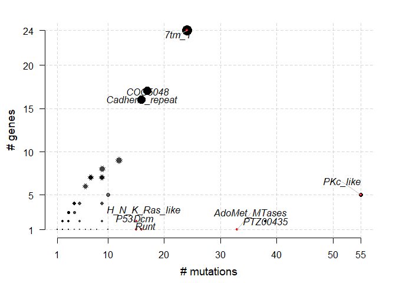

``` r
#Protein summary (Printing first 7 columns for display convenience)
laml.pfam$proteinSummary[,1:7, with = FALSE]
```

    ##         HGNC AAPos Variant_Classification  N total  fraction   DomainLabel
    ##    1: DNMT3A   882      Missense_Mutation 27    54 0.5000000 AdoMet_MTases
    ##    2:   IDH1   132      Missense_Mutation 18    18 1.0000000      PTZ00435
    ##    3:   IDH2   140      Missense_Mutation 17    20 0.8500000      PTZ00435
    ##    4:   FLT3   835      Missense_Mutation 14    52 0.2692308      PKc_like
    ##    5:   FLT3   599           In_Frame_Ins 10    52 0.1923077      PKc_like
    ##   ---                                                                     
    ## 1512: ZNF646   875      Missense_Mutation  1     1 1.0000000          <NA>
    ## 1513: ZNF687   554      Missense_Mutation  1     2 0.5000000          <NA>
    ## 1514: ZNF687   363      Missense_Mutation  1     2 0.5000000          <NA>
    ## 1515: ZNF75D     5      Missense_Mutation  1     1 1.0000000          <NA>
    ## 1516: ZNF827   427        Frame_Shift_Del  1     1 1.0000000          <NA>

``` r
#Domain summary (Printing first 3 columns for display convenience)
laml.pfam$domainSummary[,1:3, with = FALSE]
```

    ##        DomainLabel nMuts nGenes
    ##   1:      PKc_like    55      5
    ##   2:      PTZ00435    38      2
    ##   3: AdoMet_MTases    33      1
    ##   4:         7tm_1    24     24
    ##   5:       COG5048    17     17
    ##  ---                           
    ## 499:    ribokinase     1      1
    ## 500:   rim_protein     1      1
    ## 501: sigpep_I_bact     1      1
    ## 502:           trp     1      1
    ## 503:        zf-BED     1      1

``` r
#Survival analysis based on grouping of DNMT3A mutation status
mafSurvival(maf = laml.maf, genes = 'DNMT3A', time = 'days_to_last_followup', Status = 'Overall_Survival_Status', isTCGA = TRUE)
```

    ## Looking for clinical data in annoatation slot of MAF..

    ## Number of mutated samples for given genes:

    ## DNMT3A 
    ##     48

    ## Removed 11 samples with NA's

    ## Median survival..

    ##     Group medianTime   N
    ## 1: Mutant        245  45
    ## 2:     WT        396 137

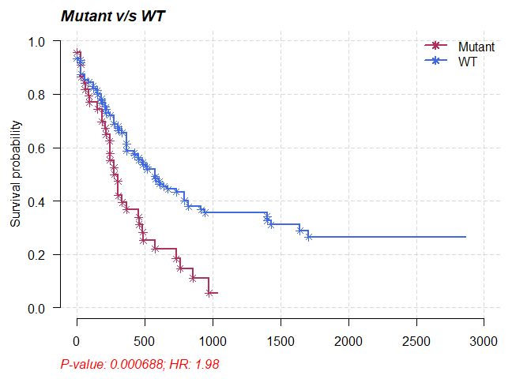

``` r
#Using top 20 mutated genes to identify a set of genes (of size 2) to predict poor prognostic groups
prog_geneset = survGroup(maf = laml.maf, top = 20, geneSetSize = 2, time = "days_to_last_followup", Status = "Overall_Survival_Status", verbose = FALSE)
```

    ## Removed 11 samples with NA's

``` r
print(prog_geneset)
```

    ##     Gene_combination P_value    hr  WT Mutant
    ##  1:      FLT3_DNMT3A 0.00104 2.510 164     18
    ##  2:      DNMT3A_SMC3 0.04880 2.220 176      6
    ##  3:      DNMT3A_NPM1 0.07190 1.720 166     16
    ##  4:      DNMT3A_TET2 0.19600 1.780 176      6
    ##  5:        FLT3_TET2 0.20700 1.860 177      5
    ##  6:        NPM1_IDH1 0.21900 0.495 176      6
    ##  7:      DNMT3A_IDH1 0.29300 1.500 173      9
    ##  8:       IDH2_RUNX1 0.31800 1.580 176      6
    ##  9:        FLT3_NPM1 0.53600 1.210 165     17
    ## 10:      DNMT3A_IDH2 0.68000 0.747 178      4
    ## 11:      DNMT3A_NRAS 0.99200 0.986 178      4

``` r
mafSurvGroup(maf = laml.maf, geneSet = c("DNMT3A", "FLT3"), time = "days_to_last_followup", Status = "Overall_Survival_Status")
```

    ## Looking for clinical data in annoatation slot of MAF..

    ## Removed 11 samples with NA's

    ## Median survival..

    ##     Group medianTime   N
    ## 1: Mutant      242.5  18
    ## 2:     WT      379.5 164

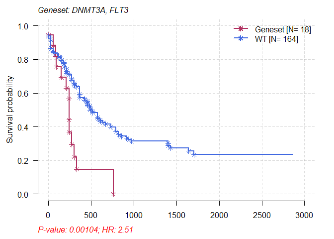

``` r
#Primary APL MAF
primary.apl = read.maf("APL_primary.maf")
```

    ## -Reading
    ## -Validating
    ## --Non MAF specific values in Variant_Classification column:
    ##   ITD
    ## -Silent variants: 45 
    ## -Summarizing
    ## -Processing clinical data
    ## --Missing clinical data
    ## -Finished in 0.250s elapsed (0.240s cpu)

``` r
#Relapse APL MAF
relapse.apl = read.maf("APL_relapse.maf")
```

    ## -Reading
    ## -Validating
    ## --Non MAF specific values in Variant_Classification column:
    ##   ITD
    ## -Silent variants: 19 
    ## -Summarizing
    ## -Processing clinical data
    ## --Missing clinical data
    ## -Finished in 0.250s elapsed (0.180s cpu)

``` r
#Considering only genes which are mutated in at-least in 5 samples in one of the cohort to avoid bias due to genes mutated in single sample.
pt.vs.rt <- mafCompare(m1 = primary.apl, m2 = relapse.apl, m1Name = 'Primary', m2Name = 'Relapse', minMut = 5)
print(pt.vs.rt)
```

    ## $results
    ##    Hugo_Symbol Primary Relapse         pval         or       ci.up      ci.low
    ## 1:         PML       1      11 1.529935e-05 0.03537381   0.2552937 0.000806034
    ## 2:        RARA       0       7 2.574810e-04 0.00000000   0.3006159 0.000000000
    ## 3:       RUNX1       1       5 1.310500e-02 0.08740567   0.8076265 0.001813280
    ## 4:        FLT3      26       4 1.812779e-02 3.56086275  14.7701728 1.149009169
    ## 5:      ARID1B       5       8 2.758396e-02 0.26480490   0.9698686 0.064804160
    ## 6:         WT1      20      14 2.229087e-01 0.60619329   1.4223101 0.263440988
    ## 7:        KRAS       6       1 4.334067e-01 2.88486293 135.5393108 0.337679367
    ## 8:        NRAS      15       4 4.353567e-01 1.85209500   8.0373994 0.553883512
    ## 9:      ARID1A       7       4 7.457274e-01 0.80869223   3.9297309 0.195710173
    ##         adjPval
    ## 1: 0.0001376942
    ## 2: 0.0011586643
    ## 3: 0.0393149868
    ## 4: 0.0407875250
    ## 5: 0.0496511201
    ## 6: 0.3343630535
    ## 7: 0.4897762916
    ## 8: 0.4897762916
    ## 9: 0.7457273717
    ## 
    ## $SampleSummary
    ##     Cohort SampleSize
    ## 1: Primary        124
    ## 2: Relapse         58

``` r
forestPlot(mafCompareRes = pt.vs.rt, pVal = 0.1, color = c('royalblue', 'maroon'), geneFontSize = 0.8)
```

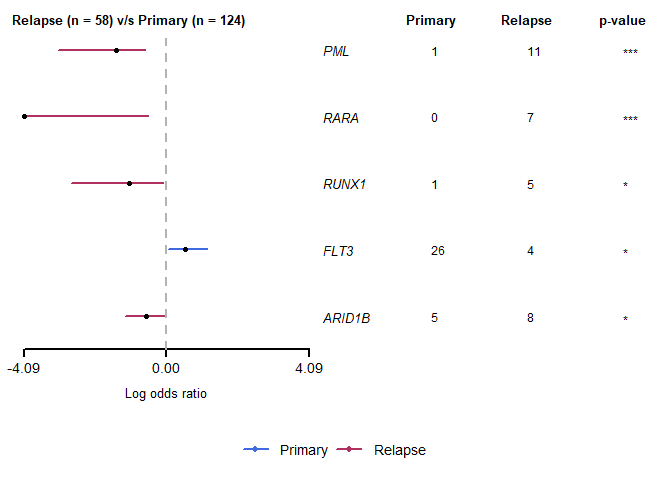

``` r
genes = c("PML", "RARA", "RUNX1", "ARID1B", "FLT3")
coOncoplot(m1 = primary.apl, m2 = relapse.apl, m1Name = 'PrimaryAPL', m2Name = 'RelapseAPL', genes = genes, removeNonMutated = TRUE)
```

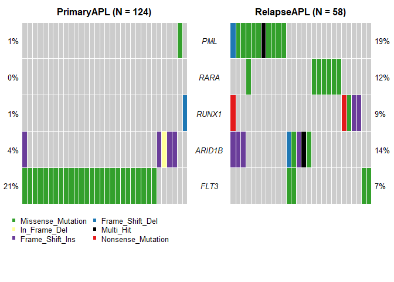

``` r
lollipopPlot2(m1 = primary.apl, m2 = relapse.apl, gene = "PML", AACol1 = "amino_acid_change", AACol2 = "amino_acid_change", m1_name = "Primary", m2_name = "Relapse")
```

    ## Gene: PML

    ## 9 transcripts available. Use arguments refSeqID or proteinID to manually specify tx name.

    ##    HGNC refseq.ID protein.ID aa.length
    ## 1:  PML NM_033238  NP_150241       882
    ## 2:  PML NM_002675  NP_002666       633
    ## 3:  PML NM_033249  NP_150252       585
    ## 4:  PML NM_033247  NP_150250       435
    ## 5:  PML NM_033239  NP_150242       829
    ## 6:  PML NM_033250  NP_150253       781
    ## 7:  PML NM_033240  NP_150243       611
    ## 8:  PML NM_033244  NP_150247       560
    ## 9:  PML NM_033246  NP_150249       423

    ## Using longer transcript NM_033238 for now.
    ## 9 transcripts available. Use arguments refSeqID or proteinID to manually specify tx name.

    ##    HGNC refseq.ID protein.ID aa.length
    ## 1:  PML NM_033238  NP_150241       882
    ## 2:  PML NM_002675  NP_002666       633
    ## 3:  PML NM_033249  NP_150252       585
    ## 4:  PML NM_033247  NP_150250       435
    ## 5:  PML NM_033239  NP_150242       829
    ## 6:  PML NM_033250  NP_150253       781
    ## 7:  PML NM_033240  NP_150243       611
    ## 8:  PML NM_033244  NP_150247       560
    ## 9:  PML NM_033246  NP_150249       423

    ## Using longer transcript NM_033238 for now.

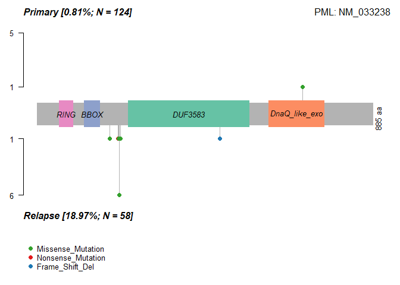

``` r
fab.ce = clinicalEnrichment(maf = laml.maf, clinicalFeature = 'FAB_classification')
```

    ## Sample size per factor in FAB_classification:

    ## 
    ## M0 M1 M2 M3 M4 M5 M6 M7 
    ## 19 44 44 21 39 19  3  3

``` r
#Results are returned as a list. Significant associations p-value < 0.05
fab.ce$groupwise_comparision[p_value < 0.05]
```

    ##    Hugo_Symbol Group1 Group2 n_mutated_group1 n_mutated_group2      p_value
    ## 1:        IDH1     M1   Rest         11 of 44         7 of 149 0.0002597371
    ## 2:        TP53     M7   Rest           3 of 3        12 of 190 0.0003857187
    ## 3:      DNMT3A     M5   Rest         10 of 19        38 of 174 0.0057610493
    ## 4:       CEBPA     M2   Rest          7 of 44         6 of 149 0.0117352110
    ## 5:       RUNX1     M0   Rest          5 of 19        11 of 174 0.0117436825
    ## 6:        NPM1     M5   Rest          7 of 19        26 of 174 0.0248582372
    ## 7:       CEBPA     M1   Rest          6 of 44         7 of 149 0.0478737468
    ##    OR_low   OR_high       fdr
    ## 1:      0 0.3926994 0.0308575
    ## 2:      0 0.1315271 0.0308575
    ## 3:      0 0.6406007 0.3072560
    ## 4:      0 0.6874270 0.3757978
    ## 5:      0 0.6466787 0.3757978
    ## 6:      0 0.8342897 0.6628863
    ## 7:      0 0.9869971 1.0000000

``` r
plotEnrichmentResults(enrich_res = fab.ce, pVal = 0.05)
```

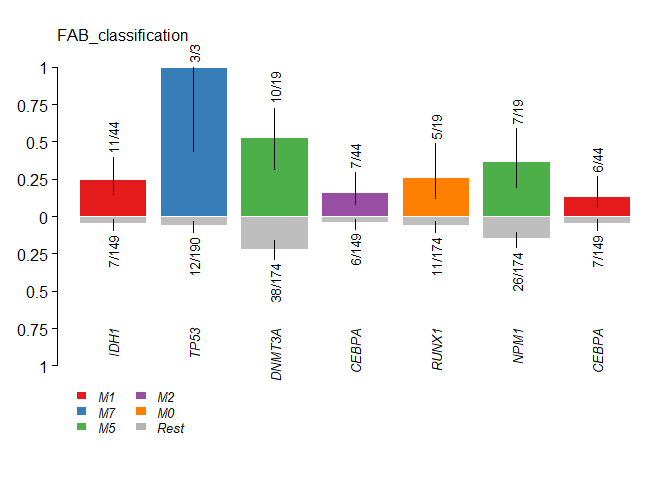

``` r
dgi = drugInteractions(maf = laml.maf, fontSize = 0.75)
```

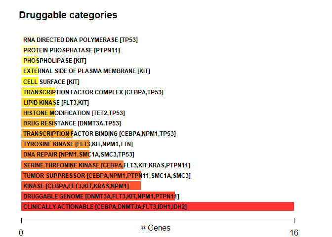

``` r
dnmt3a.dgi = drugInteractions(genes = "DNMT3A", drugs = TRUE)
```

    ## Number of claimed drugs for given genes:
    ##      Gene N
    ## 1: DNMT3A 7

``` r
#Printing selected columns.
dnmt3a.dgi[,.(Gene, interaction_types, drug_name, drug_claim_name)]
```

    ##      Gene interaction_types    drug_name drug_claim_name
    ## 1: DNMT3A                                            N/A
    ## 2: DNMT3A                   DAUNORUBICIN    Daunorubicin
    ## 3: DNMT3A                     DECITABINE      Decitabine
    ## 4: DNMT3A                     IDARUBICIN      IDARUBICIN
    ## 5: DNMT3A                     DECITABINE      DECITABINE
    ## 6: DNMT3A         inhibitor   DECITABINE   CHEMBL1201129
    ## 7: DNMT3A         inhibitor  AZACITIDINE      CHEMBL1489

``` r
OncogenicPathways(maf = laml.maf)
```

    ## Pathway alteration fractions

    ##        Pathway  N n_affected_genes fraction_affected
    ##  1:    RTK-RAS 85               18        0.21176471
    ##  2:      Hippo 38                7        0.18421053
    ##  3:      NOTCH 71                6        0.08450704
    ##  4:        MYC 13                3        0.23076923
    ##  5:        WNT 68                3        0.04411765
    ##  6:       TP53  6                2        0.33333333
    ##  7:       NRF2  3                1        0.33333333
    ##  8:       PI3K 29                1        0.03448276
    ##  9: Cell_Cycle 15                0        0.00000000
    ## 10:   TGF-Beta  7                0        0.00000000

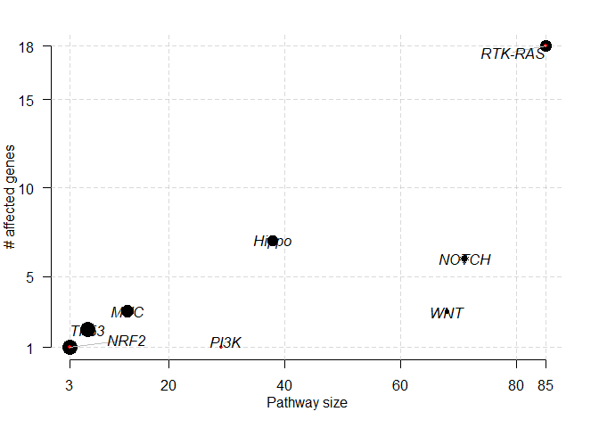

``` r
PlotOncogenicPathways(maf = laml.maf, pathways = "RTK-RAS")
```

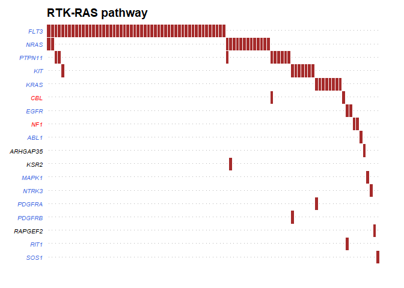

``` r
#BiocManager::install("BSgenome.Hsapiens.UCSC.hg19")
#Requires BSgenome object
library(BSgenome.Hsapiens.UCSC.hg19, quietly = TRUE)
```

    ## 
    ## Attaching package: 'BiocGenerics'

    ## The following objects are masked from 'package:parallel':
    ## 
    ##     clusterApply, clusterApplyLB, clusterCall, clusterEvalQ,
    ##     clusterExport, clusterMap, parApply, parCapply, parLapply,
    ##     parLapplyLB, parRapply, parSapply, parSapplyLB

    ## The following objects are masked from 'package:stats':
    ## 
    ##     IQR, mad, sd, var, xtabs

    ## The following objects are masked from 'package:base':
    ## 
    ##     anyDuplicated, append, as.data.frame, basename, cbind, colnames,
    ##     dirname, do.call, duplicated, eval, evalq, Filter, Find, get, grep,
    ##     grepl, intersect, is.unsorted, lapply, Map, mapply, match, mget,
    ##     order, paste, pmax, pmax.int, pmin, pmin.int, Position, rank,
    ##     rbind, Reduce, rownames, sapply, setdiff, sort, table, tapply,
    ##     union, unique, unsplit, which, which.max, which.min

    ## 
    ## Attaching package: 'S4Vectors'

    ## The following object is masked from 'package:base':
    ## 
    ##     expand.grid

    ## 
    ## Attaching package: 'IRanges'

    ## The following object is masked from 'package:grDevices':
    ## 
    ##     windows

    ## 
    ## Attaching package: 'Biostrings'

    ## The following object is masked from 'package:base':
    ## 
    ##     strsplit

``` r
laml.tnm = trinucleotideMatrix(maf = laml.maf, prefix = 'chr', add = TRUE, ref_genome = "BSgenome.Hsapiens.UCSC.hg19")
```

    ## Warning in trinucleotideMatrix(maf = laml.maf, prefix = "chr", add = TRUE, : Chromosome names in MAF must match chromosome names in reference genome.
    ## Ignorinig 101 single nucleotide variants from missing chromosomes chr23

    ## -Extracting 5' and 3' adjacent bases
    ## -Extracting +/- 20bp around mutated bases for background C>T estimation
    ## -Estimating APOBEC enrichment scores
    ## --Performing one-way Fisher's test for APOBEC enrichment
    ## ---APOBEC related mutations are enriched in  3.315 % of samples (APOBEC enrichment score > 2 ;  6  of  181  samples)
    ## -Creating mutation matrix
    ## --matrix of dimension 188x96

``` r
plotApobecDiff(tnm = laml.tnm, maf = laml.maf, pVal = 0.2)
```

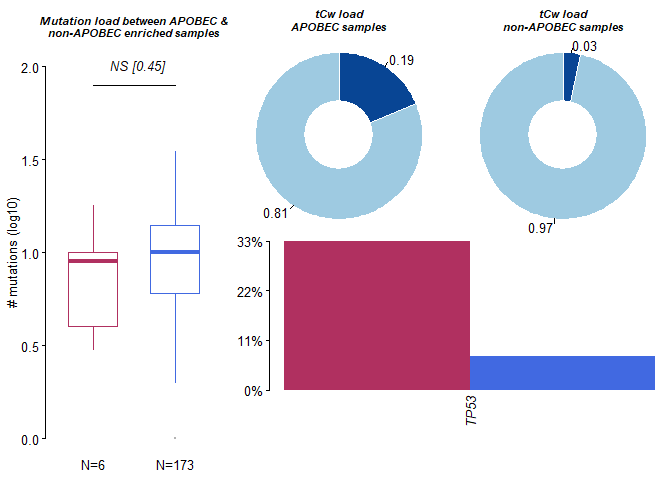

    ## $results
    ##      Hugo_Symbol Enriched nonEnriched       pval        or      ci.up
    ##   1:        TP53        2          13 0.08175632 5.9976455  46.608861
    ##   2:        TET2        1          16 0.45739351 1.9407002  18.983979
    ##   3:        FLT3        2          45 0.65523131 1.4081851  10.211621
    ##   4:      DNMT3A        1          47 1.00000000 0.5335362   4.949499
    ##   5:      ADAM11        0           2 1.00000000 0.0000000 164.191472
    ##  ---                                                                 
    ## 132:         WAC        0           2 1.00000000 0.0000000 164.191472
    ## 133:         WT1        0          12 1.00000000 0.0000000  12.690862
    ## 134:      ZBTB33        0           2 1.00000000 0.0000000 164.191472
    ## 135:      ZC3H18        0           2 1.00000000 0.0000000 164.191472
    ## 136:      ZNF687        0           2 1.00000000 0.0000000 164.191472
    ##          ci.low adjPval
    ##   1: 0.49875432       1
    ##   2: 0.03882963       1
    ##   3: 0.12341748       1
    ##   4: 0.01101929       1
    ##   5: 0.00000000       1
    ##  ---                   
    ## 132: 0.00000000       1
    ## 133: 0.00000000       1
    ## 134: 0.00000000       1
    ## 135: 0.00000000       1
    ## 136: 0.00000000       1
    ## 
    ## $SampleSummary
    ##         Cohort SampleSize  Mean Median
    ## 1:    Enriched          6 7.167    6.5
    ## 2: nonEnriched        172 9.715    9.0

``` r
#install.packages("NMF")
library('NMF')
```

    ## Warning: package 'NMF' was built under R version 3.6.3

    ## Loading required package: pkgmaker

    ## Warning: package 'pkgmaker' was built under R version 3.6.3

    ## Loading required package: registry

    ## 
    ## Attaching package: 'pkgmaker'

    ## The following object is masked from 'package:S4Vectors':
    ## 
    ##     new2

    ## Loading required package: rngtools

    ## Warning: package 'rngtools' was built under R version 3.6.3

    ## Loading required package: cluster

    ## NMF - BioConductor layer [OK] | Shared memory capabilities [NO: windows] | Cores 7/8

    ## 
    ## Attaching package: 'NMF'

    ## The following object is masked from 'package:S4Vectors':
    ## 
    ##     nrun

``` r
laml.sign = estimateSignatures(mat = laml.tnm, nTry = 6,pConstant=1)
```

    ## -Running NMF for 6 ranks
    ## Compute NMF rank= 2  ... + measures ... OK
    ## Compute NMF rank= 3  ... + measures ... OK
    ## Compute NMF rank= 4  ... + measures ... OK
    ## Compute NMF rank= 5  ... + measures ... OK
    ## Compute NMF rank= 6  ... + measures ... OK

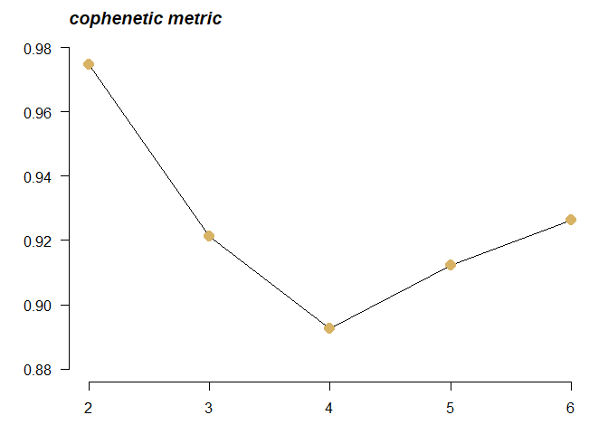

    ## -Finished in 00:01:52 elapsed (20.9s cpu)

``` r
plotCophenetic(res = laml.sign)
```


``` r
laml.sig = extractSignatures(mat = laml.tnm, n = 3,pConstant = 1)
```

    ## -Running NMF for factorization rank: 3

    ## -Finished in4.140s elapsed (3.970s cpu)

``` r
laml.og30.cosm = compareSignatures(nmfRes = laml.sig, sig_db = "legacy")
```

    ## -Comparing against COSMIC signatures

    ## ------------------------------------

    ## --Found Signature_1 most similar to COSMIC_1

    ##    Aetiology: spontaneous deamination of 5-methylcytosine [cosine-similarity: 0.9]

    ## --Found Signature_2 most similar to COSMIC_5

    ##    Aetiology: Unknown [cosine-similarity: 0.792]

    ## --Found Signature_3 most similar to COSMIC_3

    ##    Aetiology: defects in DNA-DSB repair by HR [cosine-similarity: 0.874]

    ## ------------------------------------

``` r
#Compate against updated version3 60 signatures 
laml.v3.cosm = compareSignatures(nmfRes = laml.sig, sig_db = "SBS")
```

    ## -Comparing against COSMIC signatures

    ## ------------------------------------

    ## --Found Signature_1 most similar to SBS1

    ##    Aetiology: spontaneous or enzymatic deamination of 5-methylcytosine [cosine-similarity: 0.859]

    ## --Found Signature_2 most similar to SBS3

    ##    Aetiology: Defects in DNA-DSB repair by HR [cosine-similarity: 0.785]

    ## --Found Signature_3 most similar to SBS3

    ##    Aetiology: Defects in DNA-DSB repair by HR [cosine-similarity: 0.88]

    ## ------------------------------------

``` r
#install.packages("pheatmap")
library('pheatmap')
```

    ## Warning: package 'pheatmap' was built under R version 3.6.3

``` r
pheatmap::pheatmap(mat = laml.og30.cosm$cosine_similarities, cluster_rows = FALSE, main = "cosine similarity against validated signatures")
```

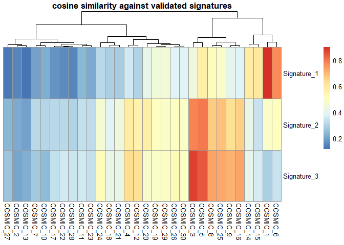

``` r
maftools::plotSignatures(nmfRes = laml.sig, title_size = 0.8)
```

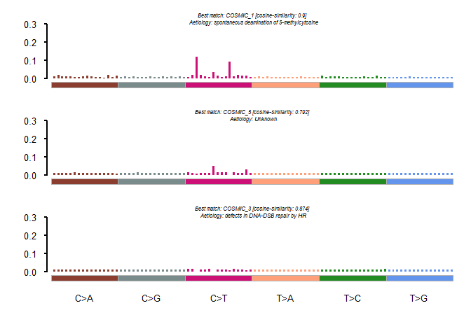

``` r
#laml.se = signatureEnrichment(maf = laml.maf, sig_res = laml.sig)
```

``` r
#plotEnrichmentResults(enrich_res = laml.se, pVal = 0.05)
```
